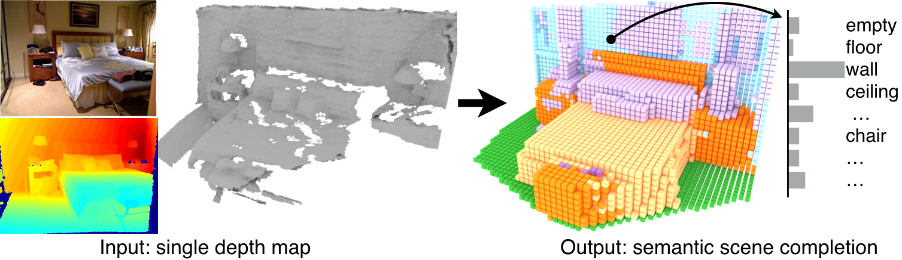

# Semantic Scene Completion from a Single Depth Image

This repo contains training and testing code for our paper on semantic scene completion, a task for producing a complete 3D voxel representation of volumetric occupancy and semantic labels for a scene from a single-view depth map observation. 
More information about the project can be found in our [paper](https://arxiv.org/pdf/1611.08974v1.pdf) and [project webset](http://sscnet.cs.princeton.edu/)

If you find [SSCNet](http://sscnet.cs.princeton.edu/) useful in your research, please cite:

    @inproceedings{SSCNet,
        author     = {Shuran Song, Fisher Yu, Andy Zeng,  Angel X. Chang,  Manolis Savva, Thomas Funkhouser},
        title      = {{S}emantic {S}cene {C}ompletion from a {S}ingle {D}epth {I}mage},
        booktitle  = arXiv,
        year       = {2016},
    }

### Contents
0. [Organization](#organization)
0. [Installation](#installation)
0. [Quick Demo](#quick-demo)
0. [Testing](#testing)
0. [Training](#training)
0. [Visualization and Evaluation](#visualization-and-evaluation)
0. [Data Preparation](#data)


### Organization
The code and data is organized as follows:
``` shell
    sscnet
         |-- matlab_code
         |-- caffe_code
                    |-- caffe3d_suncg
                    |-- script
                         |-train
                         |-test   
         |-- data
                |-- depthbin
                    |-- NYUtrain 
                        |-- xxxxx_0000.png
                        |-- xxxxx_0000.bin
                    |-- NYUtest
                    |-- NYUCADtrain
                    |-- NYUCADtest
                    |-- SUNCGtest
                    |-- SUNCGtrain01
                    |-- SUNCGtrain02
                    |-- ...
                |-- eval
                    |-- NYUtest
                    |-- NYUCADtest
                    |-- SUNCGtest
            |-- models
            |-- results
```
### Download 
0. Download the data: download_data.sh (1.1 G)
0. Download the pretrained models: download_models.sh (9.9M)
0. [optional] Download the training data: download_suncgTrain.sh (16 G)
0. [optional] Download the results: download_results.sh (8.2G)


### Installation
0. Software Requirements: 
   1. Requirements for `Caffe` and `pycaffe` (see: [Caffe installation instructions](http://caffe.berkeleyvision.org/installation.html))
   2. Matlab
   3. OPENCV
0. Hardware Requirements:  at least 12G GPU memory.
0. Install caffe and pycaffe. 
    1. Modify the config files based on your system. You can reference Makefile.config.sscnet_example.
    2. Compile  
    ```Shell
    cd caffe_code/caffe3d_suncg
    # Now follow the Caffe installation instructions here:
    #   http://caffe.berkeleyvision.org/installation.html
    make -j8 && make pycaffe
    ```
0. Export path

     ```Shell 
     export LD_LIBRARY_PATH=~/build_master_release/lib:/usr/local/cudnn/v5/lib64:~/anaconda2/lib:$LD_LIBRARY_PATH
     export PYTHONPATH=~/build_master_release/python:$PYTHONPATH
     ```

### Quick Demo:
  ```Shell 
  cd demo
  python demotest_model.py
  ```
This demo runs semantic scene compeletion on one NYU depth map using our pretrained model and outputs a '.ply' visulization of the result.


### Testing:
0. Run the testing script
  ` cd caffe_code/script/test
    python test_model.py`
0. The output results will be stored in folder `results` in .hdf5 format
0. To test on other testsets (e.g. suncg, nyu, nyucad) you need to modify the paths in “test_model.py”.
    


### Training:
0. Finetuning on NYU 
    `cd caffe_code/train/ftnyu
      ./train.sh`
0. Training from scratch 
    ` cd caffe_code/train/trainsuncg
    ./train.sh`
0. To get more training data from SUNCG, please refer to the SUNCG toolbox 
    


### Visualization and Evaluation:
0. After testing, the results should be stored in folder `results/`
0. You can also download our precomputed results:
   `./download_results.sh`
0. Run the evaluation code in matlab:
    ``` shell 
        matlab &
        cd matlab_code
        evluation_script('../results/','nyucad')
    ```
0. The visualization of results will be stored in `results/nyucad` as “.ply” files.


### Data 
0. Data format 
    1. Depth map : 
        16 bit png with bit shifting.
        Please refer to `./matlab_code/utils/readDepth.m` for more information about the depth format.
    2. 3D volume: 
        First three float stores the origin of the 3D volume in world coordinate.
        Then 16 float of camera pose in world coordinate.
        Followed by the 3D volume encoded by run-length encoding.
        Please refer to `./matlab_code/utils/readRLEfile.m` for more details.
0. Example code to convert NYU ground truth data: `matlab_code/perpareNYUCADdata.m` 
   This function provides an example of how to convert the NYU ground truth from 3D CAD model annotations provided by:
   Guo, Ruiqi, Chuhang Zou, and Derek Hoiem. "Predicting complete 3d models of indoor scenes."
   You need to download the original annotations by runing `download_UIUCCAD.sh`.  


### License
Code is released under the MIT License (refer to the LICENSE file for details).

    
